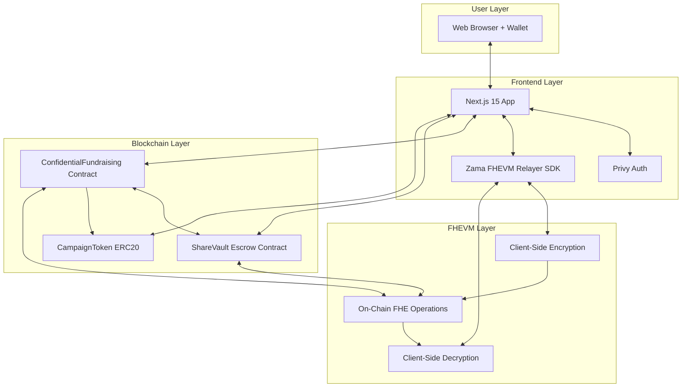
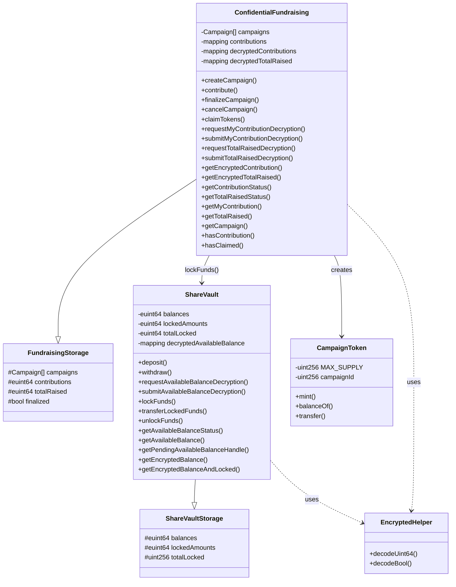
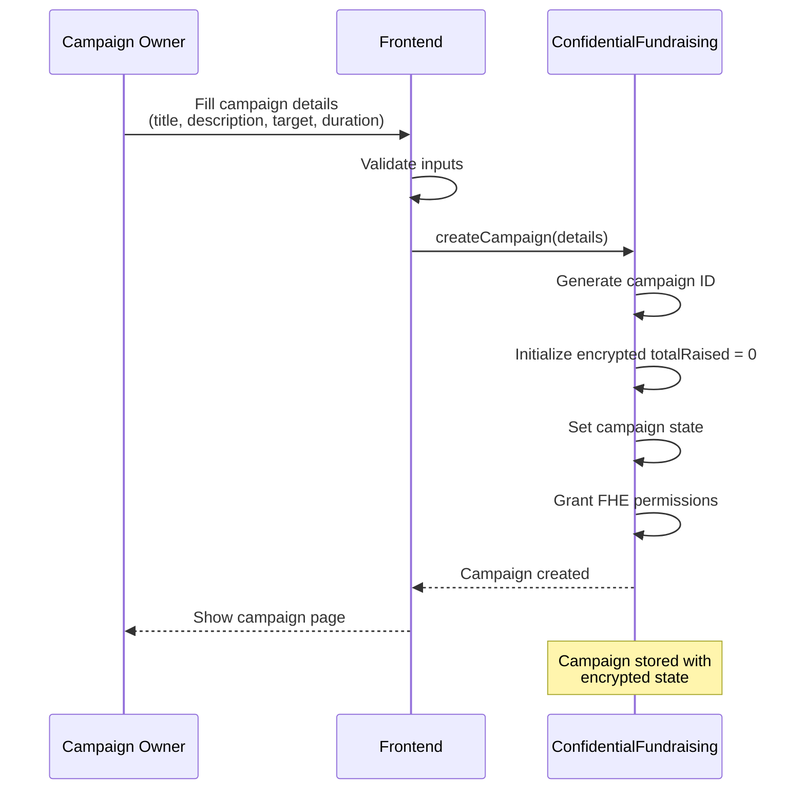
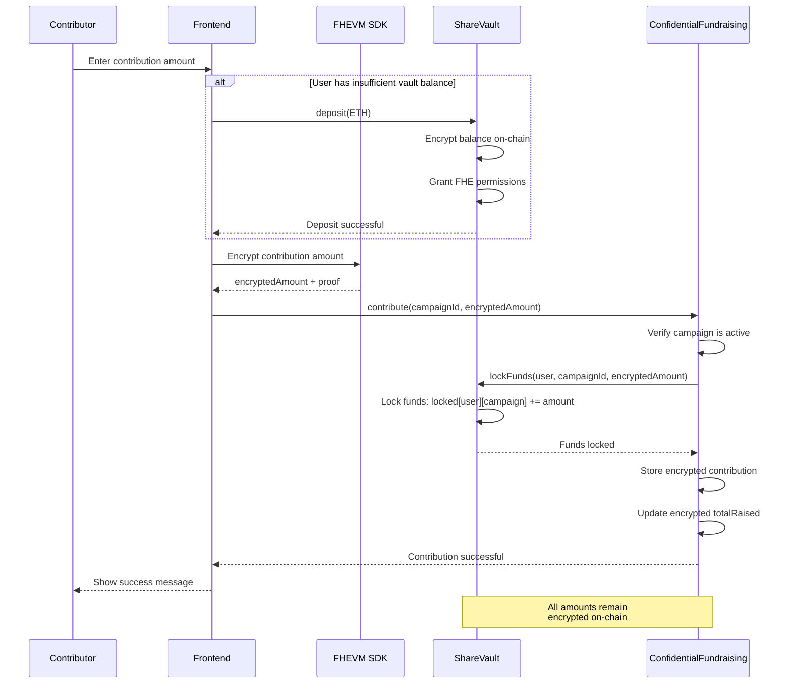
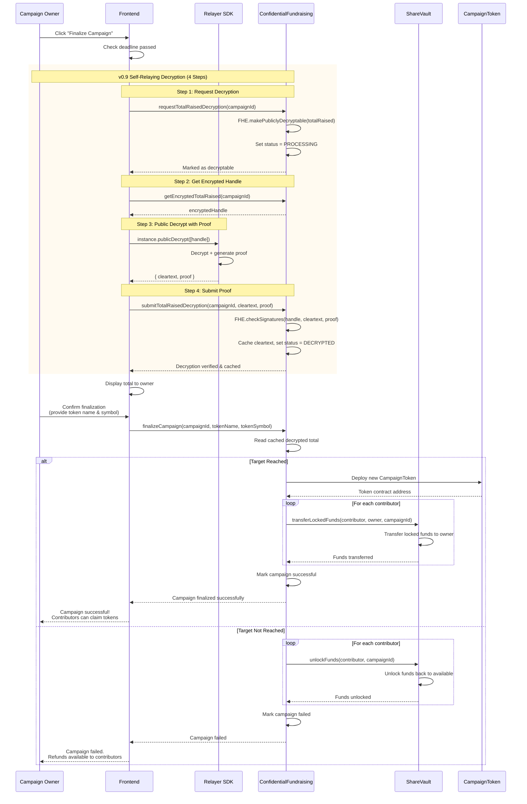
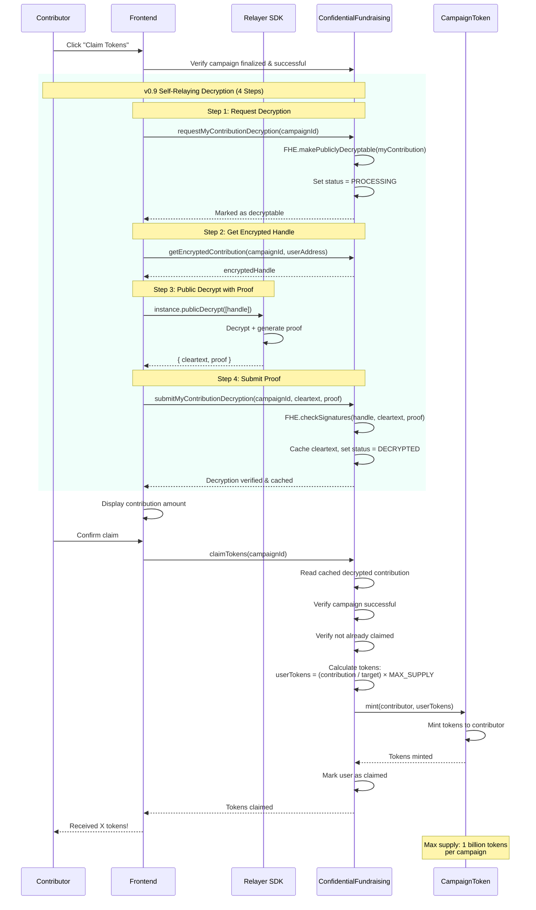
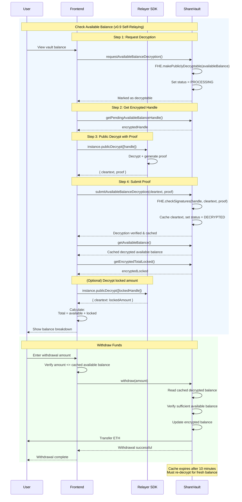
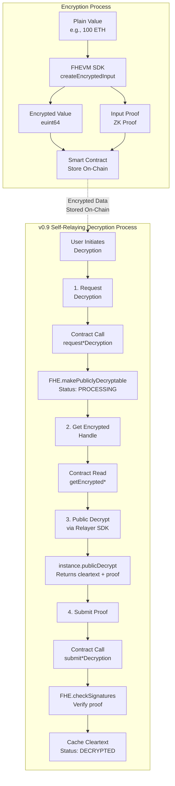

# Confidential Fundraising Platform

A privacy-preserving decentralized fundraising platform built with **FHEVM (Fully Homomorphic Encryption Virtual Machine)**. Contributors can support campaigns while keeping their contribution amounts completely private, with only authorized parties able to decrypt sensitive information.

**Author:** [@cris_thedev](https://x.com/cris_thedev)

---

## Deployed Contracts

| Contract Name | Network | Address |
|---------------|---------|---------|
| ConfidentialFundraising | Sepolia | [`0xc598A7B075bCd35D1996E3700b74f9623A4D2E37`](https://sepolia.etherscan.io/address/0xc598A7B075bCd35D1996E3700b74f9623A4D2E37) |
| ShareVault | Sepolia | [`0xAe68e85dAF30bddb969B3c572b266dCd667eb55c`](https://sepolia.etherscan.io/address/0xAe68e85dAF30bddb969B3c572b266dCd667eb55c) |

---

## Table of Contents

- [Problem Statement](#problem-statement)
- [Solution](#solution)
- [Key Features](#key-features)
- [Architecture](#architecture)
- [Technical Innovation](#technical-innovation)
- [Application Flows](#application-flows)
- [Smart Contract Specifications](#smart-contract-specifications)
- [Getting Started](#getting-started)
- [FHEVM v0.9.1 Implementation](#fhevm-v091-implementation)
- [Testing](#testing)
- [Performance Metrics](#performance-metrics)
- [Future Roadmap](#future-roadmap)
- [Resources](#resources)

---

## Problem Statement

### Traditional Crowdfunding Privacy Issues

**1. Contribution Visibility**
All donation amounts are publicly visible on traditional blockchain platforms, creating:
- Social pressure dynamics where large donations influence others
- Privacy concerns and financial exposure of contributors
- Potential discrimination based on contribution size
- Competitive intelligence for rival campaigns

**2. Trust vs Transparency Trade-off**
Existing solutions force a binary choice:
- **Full transparency** (blockchain) → No privacy for contributors
- **Full privacy** (centralized platforms) → No verifiability of funds
- No middle ground exists

**3. Refund Complexity**
Failed campaigns require manual refund processes that are:
- Time-consuming and error-prone
- Expensive due to gas costs for individual refunds
- Trust-dependent on campaign owner to initiate refunds

---

## Solution

### FHEVM-Powered Private Fundraising

**How Fully Homomorphic Encryption Solves This:**

**1. Encrypted Contributions**
Using FHEVM's `euint64` type:
- Contribution amounts stored as encrypted ciphertexts on-chain
- Mathematical operations (addition, comparison) work directly on encrypted data
- No plaintext exposure during any computation

**2. Selective Decryption**
v0.9.1 self-relaying pattern enables:
- Campaign owners decrypt only the total raised (not individual contributions)
- Contributors decrypt only their own contribution (for token claims)
- Cryptographic proofs prevent tampering or false submissions

**3. Automated Escrow**
ShareVault contract provides:
- Encrypted balance tracking per user
- Per-campaign fund locking prevents double-spending
- Automatic unlocking on campaign failure (no manual refunds needed)
- Atomic fund transfer to owner on success

### Mathematical Foundation

For contributors A, B, C with encrypted contributions `eA`, `eB`, `eC`:

```solidity
Total = FHE.add(FHE.add(eA, eB), eC)  // Encrypted total
```

The campaign owner can decrypt `Total` without ever seeing `eA`, `eB`, or `eC` individually.

### Privacy Guarantees

- Contribution amounts never visible to public
- Campaign totals hidden until owner decryption
- Vault balances private (only owner can decrypt their own)
- Zero-knowledge proofs ensure correctness without revelation
- All computations happen on encrypted data (no intermediate plaintext)

---

## Key Features

- **Private Contributions** - All contribution amounts encrypted using FHEVM technology
- **Goal-Based Campaigns** - Campaigns have targets and deadlines
- **Token Rewards** - Successful campaigns distribute ERC20 tokens proportionally to contributors
- **Automatic Refunds** - Failed campaigns automatically refund contributors
- **Secure Escrow** - ShareVault contract manages all funds with encrypted balance tracking
- **Self-Relaying Decryption** - Instant decryption with cryptographic proofs (FHEVM v0.9)
- **Zero-Knowledge** - Campaign totals remain private until authorized decryption
- **User-Controlled** - Contributors sign and submit their own decryption requests

---

## Architecture

### System Overview

The platform consists of three main layers: Smart Contracts (on-chain logic), Frontend Application (user interface), and FHEVM Layer (encryption/decryption).



### Smart Contract Architecture



---

## Technical Innovation

### Why FHEVM v0.9.1?

This project leverages **FHEVM v0.9.1's self-relaying decryption** pattern, which provides significant advantages over traditional oracle-based decryption:

| Feature | v0.8 Oracle Decryption | v0.9.1 Self-Relaying | Improvement |
|---------|----------------------|---------------------|-------------|
| **Latency** | 10-30 seconds (gateway callback) | 1-3 seconds (direct) | **10-30x faster** |
| **User Control** | Gateway submits transaction | User signs & submits | **Full user control** |
| **Transparency** | Opaque oracle process | Cryptographic proof on-chain | **Verifiable** |
| **Cost** | Oracle relay fees + gas | Gas only | **Lower cost** |
| **Status Tracking** | Limited visibility | NONE/PROCESSING/DECRYPTED states | **Better UX** |

### FHE Operations Used

The platform utilizes these FHEVM operations for encrypted computation:

**Arithmetic Operations:**
```solidity
// Adding encrypted contributions
euint64 newTotal = FHE.add(currentTotal, encryptedContribution);

// Subtracting from encrypted balance
euint64 newBalance = FHE.sub(balance, withdrawAmount);
```

**Comparison & Conditional Operations:**
```solidity
// Check if balance >= required amount
ebool hasSufficient = FHE.ge(availableBalance, requiredAmount);

// Conditional selection (ternary for encrypted values)
euint64 lockAmount = FHE.select(hasSufficient, requiredAmount, FHE.asEuint64(0));
```

**Decryption Workflow:**
```solidity
// Step 1: Mark as publicly decryptable
FHE.makePubliclyDecryptable(encryptedValue);

// Step 4: Verify cryptographic proof
bytes32[] memory handles = new bytes32[](1);
handles[0] = FHE.toBytes32(encryptedValue);
bytes memory cleartexts = abi.encode(cleartextValue);
FHE.checkSignatures(handles, cleartexts, proof);  // Throws if invalid
```

### Gas Optimization Strategies

**1. Type Optimization**
- `uint16` for campaign IDs (max 65,535 campaigns, saves 14 bytes per ID)
- `uint64` for amounts (max ~18.4 ETH, sufficient for most campaigns)
- Packed structs to minimize storage slots

**2. Encrypted Operations**
- All balance arithmetic happens encrypted (no decrypt-modify-encrypt cycles)
- FHE operations are gas-intensive but eliminate decryption overhead

**3. Cache Management**
- 10-minute cache expiry prevents redundant decryptions
- Cached values stored in mappings for O(1) access
- Status tracking prevents duplicate decryption requests

**4. Batch Operations**
- Token distribution happens per-contributor (gas paid by claimer)
- Vault locking uses per-campaign granularity
- No unbounded loops in state-changing functions

### Security Architecture

**Access Control Matrix:**

| Function | Public | Contributor | Campaign Owner | Vault Owner |
|----------|--------|-------------|----------------|-------------|
| `createCampaign()` | Yes | Yes | Yes | Yes |
| `contribute()` | Yes | Yes | Yes | Yes |
| `finalizeCampaign()` | No | No | Yes | No |
| `cancelCampaign()` | No | No | Yes | No |
| `claimTokens()` | No | Yes (if contributed) | No | No |
| `requestMyContributionDecryption()` | No | Yes (own only) | No | No |
| `requestTotalRaisedDecryption()` | No | No | Yes | No |
| `requestAvailableBalanceDecryption()` | Yes (own balance) | Yes (own balance) | Yes (own balance) | Yes (own balance) |
| `deposit()` | Yes | Yes | Yes | Yes |
| `withdraw()` | Yes (own funds) | Yes (own funds) | Yes (own funds) | Yes (own funds) |

**Attack Vectors & Mitigations:**

1. **Double-Spending Prevention**
   - Attack: Contributor tries to use same funds for multiple campaigns
   - Mitigation: Per-campaign fund locking in ShareVault, `totalLocked` tracking

2. **Decryption Proof Forgery**
   - Attack: Submit fake cleartext with forged proof
   - Mitigation: `FHE.checkSignatures()` cryptographically verifies proof against encrypted handle

3. **Cache Poisoning**
   - Attack: Manipulate cached decrypted values
   - Mitigation: Cache only written after proof verification, 10-min expiry forces refresh

4. **Unauthorized Fund Transfer**
   - Attack: Non-campaign contract tries to call `lockFunds()`
   - Mitigation: `onlyCampaignContract` modifier on ShareVault internal functions

5. **Finalization Without Decryption**
   - Attack: Finalize campaign without knowing actual total
   - Mitigation: Requires cached decrypted total, reverts if not decrypted or expired

6. **Token Supply Manipulation**
   - Attack: Mint unlimited tokens
   - Mitigation: MAX_SUPPLY constant (1 billion), reverts if exceeded

**FHE Permission Management:**

```solidity
// Encryption happens client-side with user's wallet signature
FHE.allow(encryptedValue, address(this));  // Grant contract access
FHE.allow(encryptedValue, msg.sender);     // Grant user access
```

All encrypted values have explicit permission grants to prevent unauthorized access attempts.

---

## Application Flows

### Campaign Creation Flow



### Contribution Flow



### Campaign Finalization Flow



### Token Claim Flow



### Vault Balance & Withdrawal Flow



### Encryption & Decryption Technical Flow



#### Decryption Workflow Details (v0.9.1)

The platform uses **FHEVM v0.9.1 self-relaying decryption** for secure and instant value decryption:

**4-Step Self-Relaying Process:**

1. **Request Decryption** - User calls `request*Decryption()` which marks the encrypted value as publicly decryptable using `FHE.makePubliclyDecryptable()` and sets status to `PROCESSING`

2. **Get Handle** - Frontend retrieves the encrypted handle by calling `getEncrypted*()` view function

3. **Public Decrypt** - Relayer SDK's `instance.publicDecrypt([handle])` decrypts the value and generates cryptographic proof

4. **Submit Proof** - User calls `submit*Decryption(cleartext, proof)` which verifies via `FHE.checkSignatures()`, caches the cleartext, and sets status to `DECRYPTED`

**Decryption Variants by Use Case:**

| Use Case | Request Function | Submit Function | Access Control |
|----------|-----------------|-----------------|----------------|
| **My Contribution** | `requestMyContributionDecryption(campaignId)` | `submitMyContributionDecryption(campaignId, cleartext, proof)` | Contributor only |
| **Campaign Total** | `requestTotalRaisedDecryption(campaignId)` | `submitTotalRaisedDecryption(campaignId, cleartext, proof)` | Campaign owner only |
| **Vault Balance** | `requestAvailableBalanceDecryption()` | `submitAvailableBalanceDecryption(cleartext, proof)` | Account owner only |

**Status Tracking:**
- `NONE (0)` - Initial state, not yet requested
- `PROCESSING (1)` - Decryption requested, waiting for proof submission
- `DECRYPTED (2)` - Cleartext cached and available

**Cache Management:**
- Decrypted values cached for **10 minutes** (600 seconds)
- After expiration, must repeat the 4-step workflow
- Status functions: `get*Status()` return status, cached value, and expiry timestamp

**Benefits over Oracle-based decryption:**
- **Instant** - No waiting for gateway callbacks (saves 10-30 seconds)
- **Secure** - Cryptographic proofs prevent tampering
- **User-controlled** - Users sign and submit their own decryption requests
- **Cost-effective** - Single transaction flow, no oracle relay fees

---

## Smart Contract Specifications

### ConfidentialFundraising Contract

**Address:** Set in `NEXT_PUBLIC_CONTRACT_ADDRESS`

**Purpose:** Main fundraising campaign management contract

#### Key Functions

**Campaign Management:**

| Function | Parameters | Description | Access |
|----------|-----------|-------------|--------|
| `createCampaign` | `title`, `description`, `target`, `duration` | Creates new campaign with encrypted total tracker | Public |
| `contribute` | `campaignId`, `encryptedAmount`, `inputProof` | Make encrypted contribution (locks funds in vault) | Public |
| `finalizeCampaign` | `campaignId`, `tokenName`, `tokenSymbol` | Finalize campaign after deadline (requires decrypted total) | Owner only |
| `cancelCampaign` | `campaignId` | Cancel campaign and unlock all funds | Owner only |
| `claimTokens` | `campaignId` | Claim proportional ERC20 tokens (requires decrypted contribution) | Contributors |

**v0.9 Decryption - My Contribution:**

| Function | Parameters | Description | Access |
|----------|-----------|-------------|--------|
| `requestMyContributionDecryption` | `campaignId` | Mark user's contribution as publicly decryptable (Step 1) | Contributor |
| `submitMyContributionDecryption` | `campaignId`, `cleartext`, `proof` | Submit decrypted contribution with proof (Step 4) | Contributor |
| `getMyContribution` | `campaignId` | Get cached decrypted contribution amount | Contributor |
| `getContributionStatus` | `campaignId`, `user` | Get decryption status, cached value, and expiry | Public (read) |

**v0.9 Decryption - Campaign Total:**

| Function | Parameters | Description | Access |
|----------|-----------|-------------|--------|
| `requestTotalRaisedDecryption` | `campaignId` | Mark total raised as publicly decryptable (Step 1) | Owner only |
| `submitTotalRaisedDecryption` | `campaignId`, `cleartext`, `proof` | Submit decrypted total with proof (Step 4) | Owner only |
| `getTotalRaised` | `campaignId` | Get cached decrypted total raised | Owner only |
| `getTotalRaisedStatus` | `campaignId` | Get total decryption status, cached value, and expiry | Owner only |

**Read Functions (Public):**

| Function | Parameters | Description | Return Type |
|----------|-----------|-------------|-------------|
| `getCampaign` | `campaignId` | Get campaign details (owner, title, target, deadline, etc.) | Tuple |
| `campaignCount` | - | Get total number of campaigns | uint16 |
| `getEncryptedContribution` | `campaignId`, `user` | Get encrypted contribution handle (Step 2 for decryption) | euint64 |
| `getEncryptedTotalRaised` | `campaignId` | Get encrypted total raised handle (Step 2 for decryption) | euint64 |
| `hasContribution` | `campaignId`, `user` | Check if user has contributed | bool |
| `hasClaimed` | `campaignId`, `user` | Check if user has claimed tokens | bool |
| `getCampaignContributors` | `campaignId` | Get list of contributor addresses | address[] |

#### Events

- `CampaignCreated(uint256 indexed campaignId, address indexed owner, string title, uint256 targetAmount, uint256 deadline)`
- `ContributionMade(uint256 indexed campaignId, address indexed contributor)`
- `CampaignFinalized(uint256 indexed campaignId, bool targetReached)`
- `CampaignCancelled(uint256 indexed campaignId)`
- `TokensClaimed(uint256 indexed campaignId, address indexed contributor)` - Emitted when user initiates claim
- `TokensDistributed(uint16 indexed campaignId, address indexed contributor, uint256 amount)` - Emitted with token amount
- `CampaignFailed(uint16 indexed campaignId)`

#### Storage

- `Campaign[] public campaigns` - Array of all campaigns
- `mapping(uint256 => mapping(address => euint64)) contributions` - Encrypted contributions
- `mapping(uint256 => euint64) totalRaised` - Encrypted campaign totals

---

### ShareVault Contract

**Address:** Set in `NEXT_PUBLIC_VAULT_ADDRESS`

**Purpose:** Secure escrow managing encrypted user balances and campaign locks

#### Key Functions

**Balance Management:**

| Function | Parameters | Description | Access |
|----------|-----------|-------------|--------|
| `deposit` | - (payable) | Deposit ETH into vault (increases encrypted balance) | Public |
| `withdraw` | `amount` | Withdraw from available balance (requires decrypted balance) | Public |
| `setCampaignContract` | `contractAddress` | Set authorized campaign contract address | Owner only |

**Campaign Lock Operations (Called by Campaign Contract):**

| Function | Parameters | Description | Access |
|----------|-----------|-------------|--------|
| `lockFunds` | `user`, `campaignId`, `encryptedAmount` | Lock user funds for specific campaign | Campaign contract |
| `transferLockedFunds` | `from`, `to`, `campaignId` | Transfer locked funds (campaign successful) | Campaign contract |
| `unlockFunds` | `user`, `campaignId` | Unlock funds back to available (campaign failed/cancelled) | Campaign contract |

**v0.9 Decryption - Available Balance:**

| Function | Parameters | Description | Access |
|----------|-----------|-------------|--------|
| `requestAvailableBalanceDecryption` | - | Mark user's available balance as publicly decryptable (Step 1) | User |
| `submitAvailableBalanceDecryption` | `cleartext`, `proof` | Submit decrypted balance with proof (Step 4) | User |
| `getAvailableBalance` | - | Get cached decrypted available balance | User |
| `getAvailableBalanceStatus` | - | Get balance decryption status, cached value, and expiry | User |

**Read Functions (Public):**

| Function | Parameters | Description | Return Type |
|----------|-----------|-------------|-------------|
| `getPendingAvailableBalanceHandle` | - | Get pending decryption handle (Step 2 for decryption) | euint64 |
| `getEncryptedBalance` | - | Get user's total encrypted balance | euint64 |
| `getEncryptedBalanceAndLocked` | - | Get encrypted balance and total locked amount | (euint64, euint64) |
| `getEncryptedTotalLocked` | - | Get total locked amount across all campaigns | euint64 |

#### Events

- `Deposited(address indexed user, uint256 amount)`
- `Withdrawn(address indexed user, uint256 amount)`
- `FundsLocked(address indexed user, uint16 indexed campaignId)`
- `FundsUnlocked(address indexed user, uint16 indexed campaignId)`
- `FundsTransferred(address indexed from, address indexed to, uint16 indexed campaignId)`
- `WithdrawalDecryptionRequested(address indexed user, uint256 requestId)`
- `AvailableBalanceDecrypted(address indexed user, uint64 amount)`
- `LockRequestInitiated(address indexed user, uint16 indexed campaignId, uint256 requestId)`

#### Storage

- `mapping(address => euint64) private balances` - Encrypted user balances
- `mapping(address => mapping(uint256 => euint64)) private lockedAmounts` - Per-campaign locks
- `mapping(address => uint256) private totalLocked` - Total locked per user

---

### CampaignToken Contract (ERC20)

**Address:** Deployed dynamically per campaign

**Purpose:** Campaign-specific reward tokens for successful campaigns

**Specifications:**
- **Standard:** ERC20
- **Max Supply:** 1,000,000,000 (1 billion tokens)
- **Decimals:** 18
- **Distribution:** Proportional to contribution amount
- **Formula:** `userTokens = (userContribution / campaignTarget) × MAX_SUPPLY`

#### Key Functions

| Function | Parameters | Description | Access |
|----------|-----------|-------------|--------|
| `mint` | `to`, `amount` | Mint tokens to address | Owner only (ConfidentialFundraising) |
| `balanceOf` | `account` | Get token balance | Public (read) |
| `transfer` | `to`, `amount` | Transfer tokens | Token holder |

**Metadata:**
- Name and symbol set by campaign owner during finalization
- Immutable `campaignId` reference
- Cannot mint beyond MAX_SUPPLY

---

## Getting Started

### Prerequisites

Ensure you have the following installed:

| Technology | Version | Purpose |
|------------|---------|---------|
| **Node.js** | >= 20.0.0 | Runtime environment |
| **npm** or **yarn** | Latest | Package manager |
| **Git** | Latest | Version control |
| **MetaMask** or compatible wallet | Latest | Web3 wallet |
| **Hardhat** | ^2.22.15 | Smart contract development |
| **TypeScript** | >= 5.0.0 | Type safety |

### Technology Stack

#### Smart Contracts
- **Solidity:** 0.8.24
- **FHEVM Core Contracts:** ^0.8.0
- **FHEVM Solidity:** ^0.9.1 (Self-relaying decryption)
- **FHEVM Hardhat Plugin:** ^0.3.0-1
- **Hardhat:** Development environment
- **TypeChain:** Type-safe contract interactions
- **Ethers v6:** Web3 library

#### Frontend
- **Next.js:** 15.0.0 (App Router)
- **React:** 19.1.0
- **TypeScript:** ^5.0.0
- **Viem:** ^2.21.53 (Ethereum client)
- **Ethers:** ^6.13.4 (Provider/Signer)
- **Privy:** ^3.0.1 (Wallet authentication)
- **Zama FHEVM Relayer SDK:** ^0.3.0-5 (Encryption/Decryption)
- **Tailwind CSS:** ^3.4.17 (Styling)

### Installation

#### 1. Clone the Repository

```bash
git clone git@github.com:cris-the-dev/confidential-fundraising.git
cd confidential-fundraising
```

#### 2. Install Contract Dependencies

```bash
npm install
```

#### 3. Install Frontend Dependencies

```bash
cd fundraising-frontend
npm install
```

#### 4. Configure Environment Variables

**Root `.env` file** (for contract deployment):
```bash
# Create .env file in root directory
cp .env.example .env

# Add your configuration
PRIVATE_KEY=your_wallet_private_key
SEPOLIA_RPC_URL=https://sepolia.infura.io/v3/YOUR_INFURA_KEY
ETHERSCAN_API_KEY=your_etherscan_api_key
```

**Frontend `.env.local` file**:
```bash
# Create .env.local in fundraising-frontend/
cd fundraising-frontend
cp .env.example .env.local

# Add your configuration
NEXT_PUBLIC_CONTRACT_ADDRESS=0x... # ConfidentialFundraising contract
NEXT_PUBLIC_VAULT_ADDRESS=0x...    # ShareVault contract
NEXT_PUBLIC_CHAIN_ID=11155111      # Sepolia testnet
NEXT_PUBLIC_RPC_URL=https://sepolia.infura.io/v3/YOUR_INFURA_KEY
NEXT_PUBLIC_PRIVY_APP_ID=your_privy_app_id
```

### Development Workflow

#### Local Development with Mock FHEVM

```bash
# Terminal 1: Start local Hardhat node
npm run node

# Terminal 2: Deploy contracts to localhost
npm run deploy:localhost

# Terminal 3: Start frontend
cd fundraising-frontend
npm run dev
```

Visit `http://localhost:3000` to see the application.

#### Testing Contracts

```bash
# Run all tests
npm test

# Run tests with coverage
npm run coverage:mock

# Run specific test file
npx hardhat test test/ConfidentialFundraising.test.ts
```

#### Compile Contracts

```bash
npm run compile
```

This generates:
- Compiled artifacts in `artifacts/`
- TypeChain types in `types/`
- ABI files for frontend integration

### Deployment

#### Deploy to Sepolia Testnet

```bash
# Ensure .env is configured with PRIVATE_KEY and SEPOLIA_RPC_URL
npm run deploy:sepolia

# Verify contracts on Etherscan
npm run verify:sepolia
```

The deployment script will output contract addresses:
```
✅ ShareVault deployed to: 0x...
✅ ConfidentialFundraising deployed to: 0x...
```

Update these addresses in `fundraising-frontend/.env.local`.

#### Production Build

```bash
cd fundraising-frontend
npm run build
npm start
```

---

## FHEVM v0.9.1 Implementation

This project is built with **FHEVM v0.9.1** using the modern self-relaying decryption pattern.

### Core Technology Versions

**Smart Contracts:**
- `@fhevm/solidity`: ^0.9.1
- `@fhevm/core-contracts`: ^0.8.0
- `@fhevm/hardhat-plugin`: ^0.3.0-1

**Frontend:**
- `@zama-fhe/relayer-sdk`: ^0.3.0-5

### v0.9 Self-Relaying Pattern

The platform uses the **4-step self-relaying workflow** instead of deprecated oracle-based decryption:

**Contract Implementation:**
```solidity
// Step 1: User requests decryption
function requestMyContributionDecryption(uint16 campaignId) public {
    euint64 userContribution = encryptedContributions[campaignId][msg.sender];
    FHE.makePubliclyDecryptable(userContribution);
    decryptMyContributionStatus[campaignId][msg.sender] = DecryptStatus.PROCESSING;
}

// Step 4: User submits proof
function submitMyContributionDecryption(
    uint16 campaignId,
    uint64 cleartextAmount,
    bytes calldata proof
) public {
    euint64 userContribution = encryptedContributions[campaignId][msg.sender];

    // Verify proof
    bytes32[] memory handles = new bytes32[](1);
    handles[0] = FHE.toBytes32(userContribution);
    bytes memory cleartexts = abi.encode(cleartextAmount);
    FHE.checkSignatures(handles, cleartexts, proof);

    // Cache result
    decryptedContributions[campaignId][msg.sender] = Uint64ResultWithExp({
        data: cleartextAmount,
        exp: block.timestamp + cacheTimeout
    });

    decryptMyContributionStatus[campaignId][msg.sender] = DecryptStatus.DECRYPTED;
}
```

**Frontend Integration:**
```typescript
// Complete workflow using hook
const { completeMyContributionDecryption } = useCampaigns();

// All 4 steps handled internally:
// 1. Call requestMyContributionDecryption()
// 2. Get handle from getEncryptedContribution()
// 3. Decrypt via instance.publicDecrypt([handle])
// 4. Call submitMyContributionDecryption(cleartext, proof)
const result = await completeMyContributionDecryption(campaignId);
console.log('Decrypted value:', result.cleartext);
```

**Manual Workflow (Advanced):**
```typescript
// Step 1: Request decryption
await contract.requestMyContributionDecryption(campaignId);

// Step 2: Get encrypted handle
const handle = await contract.getEncryptedContribution(campaignId, userAddress);

// Step 3: Decrypt with relayer SDK
const { clearValues, decryptionProof } = await instance.publicDecrypt([handle]);
const cleartext = clearValues[handle];

// Step 4: Submit proof to contract
await contract.submitMyContributionDecryption(campaignId, cleartext, decryptionProof);
```

### Key Improvements

**vs Oracle-Based Decryption (v0.8):**
- **10-30x faster:** Instant decryption without gateway callbacks
- **More secure:** User-controlled with cryptographic proof verification
- **Better UX:** Users sign and submit their own requests
- **Lower cost:** Single-transaction flow, no oracle fees
- **Transparent:** Status tracking via `get*Status()` functions

**Status Management:**
```typescript
const { status, contribution, cacheExpiry } =
    await contract.getContributionStatus(campaignId, userAddress);

// status: 0 (NONE), 1 (PROCESSING), 2 (DECRYPTED)
// contribution: cached cleartext value (if decrypted)
// cacheExpiry: timestamp when cache expires (10 minutes)
```

---

## Testing & Quality Assurance

### Test Coverage

The project includes comprehensive tests for all critical paths:

**Contract Tests:**
```bash
npm test
```

**Test Categories:**
1. **Campaign Lifecycle Tests** - Create, contribute, finalize, cancel flows
2. **Vault Operations Tests** - Deposit, withdraw, lock/unlock mechanisms
3. **Decryption Workflow Tests** - v0.9.1 4-step pattern validation
4. **Access Control Tests** - Permission boundary verification
5. **Edge Case Tests** - Cache expiry, insufficient funds, invalid proofs
6. **Token Distribution Tests** - Proportional minting, supply limits

**Mock FHEVM Testing:**
```bash
npm run test:mock
```

The FHEVM Hardhat plugin provides mock FHE operations for local testing without KMS infrastructure.

**Integration Testing Checklist:**
- Campaign creation with various targets
- Multiple contributors per campaign
- Campaign finalization (success & failure paths)
- Token claiming with decryption workflow
- Vault balance management with locks
- Cache expiry and re-decryption
- Permission boundary violations
- Proof verification failures

### Known Limitations

1. **Amount Range:** `uint64` limits contributions to ~18.4 ETH max
   - **Mitigation:** Suitable for most crowdfunding scenarios; can upgrade to `euint128` if needed

2. **Campaign Count:** `uint16` allows max 65,535 campaigns
   - **Mitigation:** Sufficient for foreseeable usage; can upgrade to `uint256` if needed

3. **Cache Timeout:** 10-minute decryption cache requires re-decryption
   - **Trade-off:** Privacy vs convenience (prevents stale data attacks)

4. **Gas Costs:** FHE operations are more expensive than plaintext
   - **Comparison:** ~2-3x higher gas than non-FHE equivalent
   - **Benefit:** Privacy guarantees justify the premium

5. **Frontend Dependency:** Requires FHEVM Relayer SDK for encryption/decryption
   - **Mitigation:** CDN-hosted, but adds external dependency

---

## Performance Metrics

### Gas Cost Analysis (Estimated)

| Operation | FHEVM (This Project) | Standard EVM | Overhead |
|-----------|---------------------|--------------|----------|
| **Campaign Creation** | ~300,000 gas | ~150,000 gas | 2x |
| **Contribution** | ~450,000 gas | ~200,000 gas | 2.25x |
| **Finalization** | ~800,000 gas | ~400,000 gas | 2x |
| **Token Claim** | ~350,000 gas | ~150,000 gas | 2.3x |
| **Decryption Request** | ~120,000 gas | N/A | - |
| **Decryption Submit** | ~90,000 gas | N/A | - |
| **Vault Deposit** | ~200,000 gas | ~100,000 gas | 2x |
| **Vault Withdraw** | ~180,000 gas | ~80,000 gas | 2.25x |

**Note:** FHE operations include:
- Encrypted arithmetic (`FHE.add`, `FHE.sub`, `FHE.select`)
- Permission grants (`FHE.allow`)
- Public decryption marking (`FHE.makePubliclyDecryptable`)
- Proof verification (`FHE.checkSignatures`)

### Decryption Latency

| Step | Time (v0.9.1 Self-Relaying) | Time (v0.8 Oracle) |
|------|----------------------------|-------------------|
| **1. Request Decryption** | ~2 seconds (tx confirmation) | ~2 seconds |
| **2. Get Handle** | <1 second (read call) | <1 second |
| **3. Public Decrypt** | ~1 second (SDK call) | ~10-30 seconds (gateway) |
| **4. Submit Proof** | ~2 seconds (tx confirmation) | Auto-submitted |
| **Total** | **~5 seconds** | **~15-35 seconds** |

**User Experience Impact:**
- v0.9.1: User sees decrypted value in ~5 seconds (Fast)
- v0.8: User waits 15-35 seconds for callback (Slow)

---

## Future Roadmap

### Phase 2: Enhanced Features (Q2 2025)

1. **Milestone-Based Campaigns**
   - Unlock funds incrementally as milestones achieved
   - Encrypted milestone tracking with community voting

2. **Private Voting Mechanism**
   - Encrypted votes on campaign decisions
   - Homomorphic vote counting

3. **Multi-Token Support**
   - Accept various ERC20 tokens (encrypted amounts)
   - Cross-token contribution aggregation

4. **Reputation System**
   - Encrypted contribution history
   - Privacy-preserving reputation scores

### Phase 3: Scalability (Q3 2025)

1. **Layer 2 Integration**
   - Deploy to L2s with FHEVM support
   - Lower gas costs while maintaining privacy

2. **Batch Decryption**
   - Decrypt multiple values in single proof
   - Reduced gas costs for campaign owners

3. **Optimized Storage**
   - Compressed encrypted handles
   - Off-chain metadata with on-chain verification

### Phase 4: Advanced Privacy (Q4 2025)

1. **Anonymous Contributions**
   - Zero-knowledge proofs for contributor identity
   - Fully private donation streams

2. **Encrypted Messaging**
   - Private campaign updates to contributors
   - Encrypted comments/feedback

3. **Privacy-Preserving Analytics**
   - Encrypted contribution distributions
   - Statistical analysis without revealing individuals

### Research Directions

1. **FHE Circuit Optimization**
   - Custom circuits for campaign-specific operations
   - Reduced gas costs through specialized FHE ops

2. **Decentralized Key Management**
   - Multi-party computation for decryption authority
   - Eliminate single points of failure

3. **Compliance Integration**
   - Encrypted KYC/AML data
   - Regulatory compliance without privacy loss

---

## Zama Builder Track Highlights

### Why This Project Showcases FHEVM

1. **Real-World Use Case:** Crowdfunding is a widely understood problem that clearly benefits from confidential computing

2. **Multiple FHE Operations:** Demonstrates:
   - Encrypted arithmetic (addition for totals, subtraction for balances)
   - Encrypted comparisons (balance >= required)
   - Conditional operations (FHE.select for safe locking)
   - Selective decryption (only owner/contributor sees their data)

3. **v0.9.1 Best Practices:**
   - Full implementation of 4-step self-relaying pattern
   - Cryptographic proof verification
   - Cache management for UX optimization
   - Status tracking for transparency

4. **Production-Ready Architecture:**
   - Separation of concerns (Campaign + Vault contracts)
   - Comprehensive access control
   - Event emission for frontend integration
   - Error handling with custom errors

5. **Complete Full-Stack Integration:**
   - Next.js 15 frontend with App Router
   - Custom React hooks for FHEVM operations
   - Privy wallet integration
   - Responsive UI with real-time status updates

### Technical Challenges Overcome

1. **Encrypted Balance Management:**
   - **Problem:** How to track available vs locked balances entirely encrypted
   - **Solution:** Per-campaign locking with encrypted totalLocked tracking

2. **Proof Verification:**
   - **Problem:** Ensuring decrypted values match encrypted on-chain values
   - **Solution:** `FHE.checkSignatures()` with handle-to-cleartext validation

3. **Gas Optimization:**
   - **Problem:** FHE operations are expensive
   - **Solution:** Type optimization (uint16/uint64), caching, user-pays-for-claim model

4. **UX Without Plaintext:**
   - **Problem:** Users need to see their contribution for token claims
   - **Solution:** Self-relaying decryption with status tracking and cache

---

## Complete Workflow Reference

### End-to-End User Flows

#### 1. Campaign Creator Flow

```
1. Create Campaign
   → createCampaign(title, description, target, duration)
   → Campaign gets ID, encrypted total = 0

2. Wait for contributions...

3. After Deadline → Finalize Campaign
   a. Decrypt Total Raised (v0.9 workflow):
      → requestTotalRaisedDecryption(campaignId)
      → getEncryptedTotalRaised(campaignId)
      → instance.publicDecrypt([handle])
      → submitTotalRaisedDecryption(campaignId, cleartext, proof)

   b. Finalize:
      → finalizeCampaign(campaignId, tokenName, tokenSymbol)
      → If target reached: Deploy ERC20, transfer all locked funds
      → If target not reached: Unlock all funds for refund
```

#### 2. Contributor Flow

```
1. Deposit to Vault (optional if balance exists)
   → vault.deposit() {value: amount}

2. Contribute to Campaign
   → SDK: encryptedAmount, proof = encrypt(amount)
   → contribute(campaignId, encryptedAmount, proof)
   → Funds locked in vault for campaign

3. After Campaign Ends:

   If Successful (target reached):
     a. Decrypt My Contribution:
        → requestMyContributionDecryption(campaignId)
        → getEncryptedContribution(campaignId, userAddress)
        → instance.publicDecrypt([handle])
        → submitMyContributionDecryption(campaignId, cleartext, proof)

     b. Claim Tokens:
        → claimTokens(campaignId)
        → Receives proportional ERC20 tokens

   If Failed (target not reached):
     → Funds auto-unlocked
     → Withdraw from vault: withdraw(amount)
```

#### 3. Vault Management Flow

```
1. Deposit Funds
   → vault.deposit() {value: amount}
   → Encrypted balance += amount

2. Check Available Balance
   a. Decrypt Balance:
      → requestAvailableBalanceDecryption()
      → getPendingAvailableBalanceHandle()
      → instance.publicDecrypt([handle])
      → submitAvailableBalanceDecryption(cleartext, proof)

   b. View Balance:
      → getAvailableBalance()
      → Returns cached decrypted value

3. Withdraw Funds
   → withdraw(amount)
   → Requires prior decryption
   → Sends ETH to user wallet
```

### Frontend Hook Methods

**useCampaigns Hook:**
```typescript
// Campaign Management
createCampaign(title, description, targetAmount, durationDays)
contribute(campaignId, amount)
finalizeCampaign(campaignId, tokenName, tokenSymbol)
cancelCampaign(campaignId)
claimTokens(campaignId)

// Complete v0.9 Decryption Workflows (all 4 steps)
completeMyContributionDecryption(campaignId)
completeTotalRaisedDecryption(campaignId)
completeAvailableBalanceDecryption()

// Individual v0.9 Decryption Steps (advanced)
requestMyContributionDecryption(campaignId)        // Step 1
requestTotalRaisedDecryption(campaignId)           // Step 1
requestAvailableBalanceDecryption()                // Step 1

// Read Functions (public client - no wallet needed)
getCampaign(campaignId)
getCampaignCount()
getContributionStatus(campaignId, userAddress)
checkHasContribution(campaignId, userAddress)
checkHasClaimed(campaignId, userAddress)
getEncryptedContribution(campaignId, userAddress)  // Step 2 for decryption
getEncryptedTotalRaised(campaignId)                // Step 2 for decryption

// Vault Operations
depositToVault(amount)
withdrawFromVault(amount)
getAvailableBalanceStatus()
getEncryptedBalanceAndLocked()
```

**useEncrypt Hook:**
```typescript
// Encrypt a value for contribution
const { encryptedData, proof } = await encrypt64(amountInWei);
```

**usePublicDecrypt Hook:**
```typescript
// Decrypt an encrypted handle (Step 3 of v0.9 workflow)
const { cleartext, proof } = await publicDecrypt(handle, contractAddress);
```

### Common Error Handling

| Error | Cause | Solution |
|-------|-------|----------|
| `CampaignNotExist` | Invalid campaign ID | Check `campaignCount` |
| `CampaignEnded` | Deadline passed | Cannot contribute after deadline |
| `CampaignStillActive` | Trying to finalize early | Wait until `block.timestamp > deadline` |
| `OnlyOwner` | Not campaign owner | Only owner can finalize/cancel |
| `TotalRaisedNotDecrypted` | Finalize without decryption | Run `completeTotalRaisedDecryption()` first |
| `ContributionNotDecrypted` | Claim without decryption | Run `completeMyContributionDecryption()` first |
| `DecryptAlreadyInProgress` | Duplicate decrypt request | Wait for current workflow to complete |
| `CacheExpired` | Decryption cache expired | Re-run decryption workflow (10 min timeout) |
| `OnlyCampaignContract` | Vault access denied | Ensure `setCampaignContract()` was called |
| `InsufficientBalance` | Not enough vault funds | Deposit more ETH to vault |

---

## Network Configuration

| Network | Chain ID | RPC URL | Block Explorer |
|---------|----------|---------|----------------|
| **Sepolia** | 11155111 | `https://sepolia.infura.io/v3/...` | https://sepolia.etherscan.io |
| **Localhost** | 31337 | `http://127.0.0.1:8545` | N/A |
| **Hardhat** | 31337 | In-memory | N/A |

### Compiler Configuration

```json
{
  "solidity": "0.8.24",
  "optimizer": {
    "enabled": true,
    "runs": 200,
    "viaIR": true
  },
  "evmVersion": "cancun"
}
```

**Note:** `viaIR: true` is required for FHEVM contracts to compile correctly.

### Security Features

- **Access Control:** Owner-only functions protected by modifiers
- **FHE Permissions:** Strict permission management via `FHE.allow()`
- **Reentrancy Protection:** NonReentrant modifiers on external calls
- **Input Validation:** Comprehensive checks on all parameters
- **State Machine:** Campaign lifecycle enforced by state checks
- **Locked Funds Isolation:** Per-campaign fund locks prevent double-spending
- **Cache Expiration:** 10-minute timeout on decrypted values
- **Max Supply Enforcement:** Token minting capped at 1 billion
- **Cryptographic Proofs:** FHE.checkSignatures validates all decryptions

---

## Development Tools

### Flatten Contracts for Remix IDE

If you need to deploy contracts using Remix IDE, use the flatten script:

```bash
# Run from project root
./scripts/flatten-contracts.sh
```

This creates flattened versions in the `flattened/` directory:
- `ConfidentialFundraising_flat.sol`
- `ShareVault_flat.sol`

**Note:** Remove duplicate SPDX license identifiers if Remix shows warnings.

### Configure ShareVault After Deployment

After deploying both contracts, you must configure the ShareVault to recognize the ConfidentialFundraising contract:

```bash
VAULT_ADDRESS=0x... CAMPAIGN_ADDRESS=0x... npx hardhat run scripts/configure-vault.ts --network sepolia
```

This prevents the `OnlyCampaignContract()` error when users try to contribute.

### Create Test Campaign (Optional)

Create a demo campaign for testing:

```bash
# Edit the script first to set your contract address and campaign details
# Then run:
npx hardhat run scripts/create-campaign.ts --network sepolia
```

The script will:
1. Create a new campaign with specified title, description, target, and duration
2. Output the campaign ID for testing
3. Verify the campaign was created successfully

---

## Resources

- **FHEVM Documentation:** https://docs.zama.org/protocol
- **FHEVM v0.9 Migration Guide:** https://docs.zama.org/protocol/solidity-guides/development-guide/migration
- **Relayer SDK Guides:** https://docs.zama.org/protocol/relayer-sdk-guides
- **Hardhat Documentation:** https://hardhat.org/docs
- **Next.js Documentation:** https://nextjs.org/docs
- **Privy Documentation:** https://docs.privy.io
- **Viem Documentation:** https://viem.sh

---

## Contributing

Contributions are welcome! Please follow these steps:

1. Fork the repository
2. Create a feature branch: `git checkout -b feature/your-feature`
3. Commit changes: `git commit -m 'Add your feature'`
4. Push to branch: `git push origin feature/your-feature`
5. Open a pull request

---

## License

This project is licensed under the MIT License. See LICENSE file for details.

---

## Privacy & Security Notice

This platform uses **FHEVM (Fully Homomorphic Encryption)** to ensure:
- Contribution amounts are **never** visible on-chain in plaintext
- Only authorized parties (contributors + campaign owner) can decrypt values
- Mathematical operations (summing contributions) work on encrypted data
- Zero-knowledge proofs validate encrypted values without revealing them

**Security Audits:** TBD

---

**Built with ❤️ by [@cris_thedev](https://x.com/cris_thedev) using Zama's FHEVM technology**
